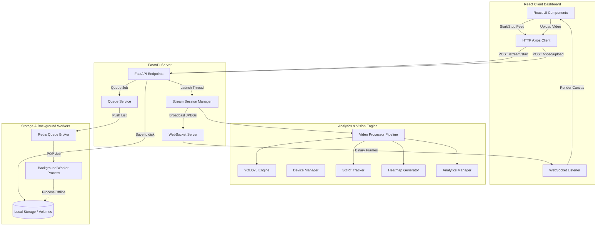

# EyeSight AI: Multi-Source Object Detection & Video Analytics System

EyeSight AI is a production-grade, highly modular, real-time computer vision system built using FastAPI, PyTorch, YOLOv8, OpenCV, and React. It supports streaming from multiple sources (local video file uploads, system webcams, and network RTSP camera feeds), handles object tracking using the SORT algorithm, computes density heatmaps, and tracks cumulative statistics.

---

## System Architecture



---

## Project Structure

- `backend/`: Core FastAPI server, settings, endpoints, background workers, and helper services.
  - `api/`: API Routers and endpoints (health checks, uploads, live streams, and WebSockets).
  - `core/`: Logger configurations and hardware `DeviceManager`.
  - `services/`: Wrappers for `YOLOEngine`, pure-python `Tracker` (SORT), `VideoProcessor` pipeline, and `VideoWriterService`.
  - `streams/`: `StreamManager` for OpenCV capture and connection retries, and thread-based `StreamSessionManager`.
  - `analytics/`: Object counter (`AnalyticsManager`) and density `HeatmapGenerator`.
  - `config/`: Configuration settings and environmental settings parser.
- `frontend/`: Single-page React dashboard built with Vite, Tailwind CSS, Axios, and WebSockets.
- `weights/`: Holds pre-trained YOLO weight assets (e.g., `yolov8n.pt`).
- `uploads/`: Repository for uploaded files.
- `results/`: Output folder for processed/annotated video exports.
- `logs/`: Diagnostic rolling logs output location.

---

## Quick Start via Docker (Recommended)

To launch the entire application stack including Redis, the FastAPI backend, the background processing worker, and the React frontend:

1. **Verify Docker and Docker Compose are installed.**
2. Run the command from the project root:
   ```bash
   docker-compose up --build
   ```
3. Once running:
   - Access the **React Web Dashboard** at: `http://localhost:3000`
   - Access the **FastAPI Swagger Docs** at: `http://localhost:8000/docs`
   - Access the **Health Endpoint** directly at: `http://localhost:8000/api/v1/health`

---

## Local Installation

### Prerequisites
- Python 3.10+
- Node.js (v18+) (optional, if running frontend outside Docker)
- Redis Server (optional, if using distributed background queues locally; falls back to native FastAPI background threads if Redis is offline)

### Backend Setup
1. Create a virtual environment and activate it:
   ```bash
   python -m venv venv
   # On Windows:
   .\venv\Scripts\activate
   # On Linux/macOS:
   source venv/bin/activate
   ```
2. Install dependencies:
   ```bash
   pip install -r requirements.txt
   ```
3. Start the FastAPI development server:
   ```bash
   python backend/app.py
   ```
4. (Optional) Run the background queue consumer worker in a separate terminal:
   ```bash
   python backend/worker.py
   ```

### Frontend Setup
1. Navigate to the frontend directory:
   ```bash
   cd frontend
   ```
2. Install npm packages:
   ```bash
   npm install
   ```
3. Run the development server:
   ```bash
   npm run dev
   ```
4. Open your browser and navigate to `http://localhost:3000`.

---

## Verification & Tests
To verify all modules and packages are configured correctly without launching the web server, run the automated integration test script:

```bash
# Activate virtual environment
.\venv\Scripts\activate

# Run pipeline check
python backend/tests/test_pipeline.py
```
This script will:
1. Detect CUDA capability and log hardware information.
2. Initialize and load the YOLOv8 model.
3. Pass a mock frame into the `VideoProcessor` pipeline.
4. Run tracker updates, heatmaps blending, and stats generation, asserting correct execution.
